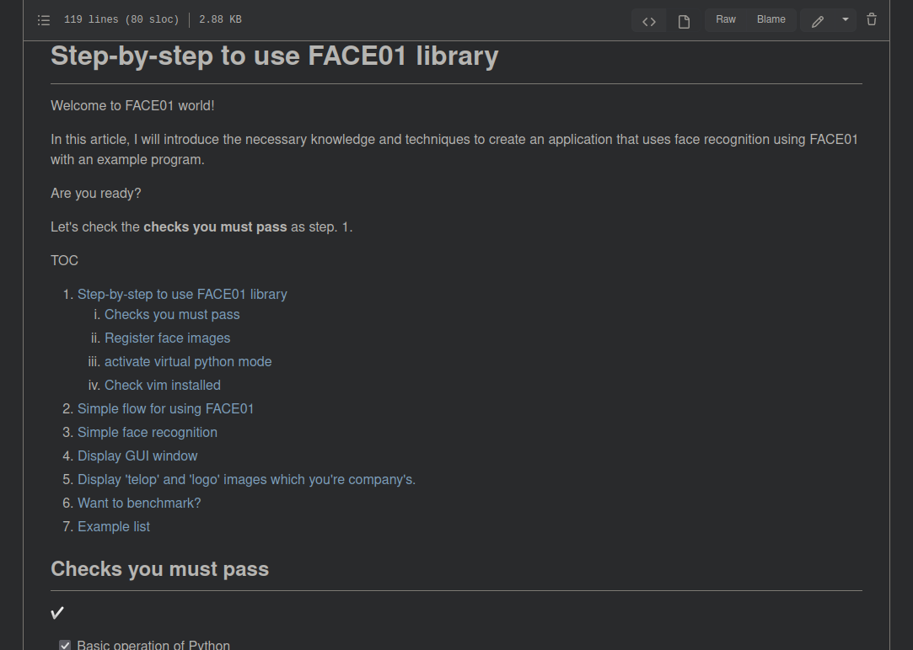
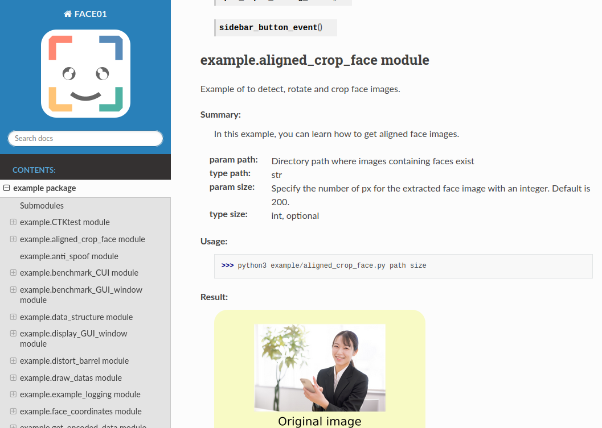
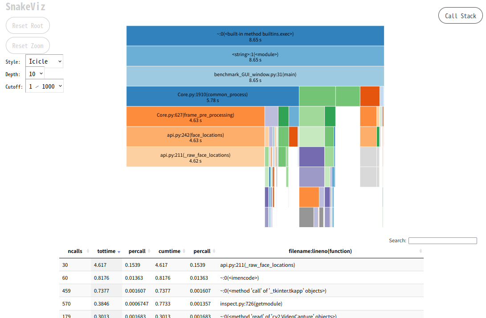
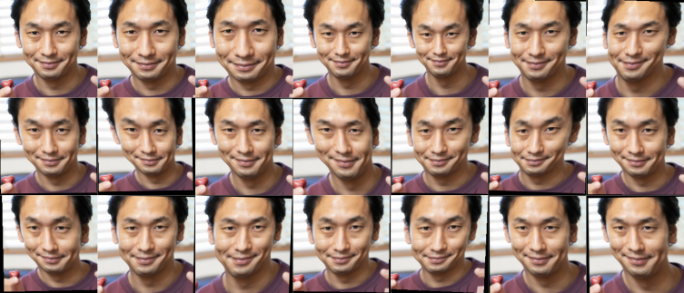
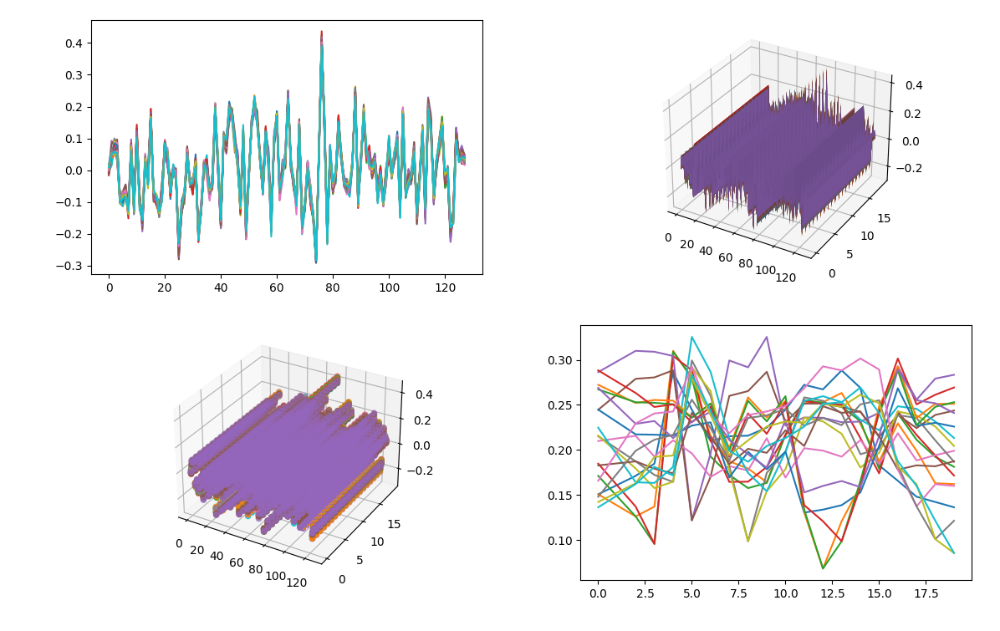

<div align="center">


** SUPER HIGHT SPEED RECOGNITION  **
** USEFUL MANY METHODS  **
** RICH AND COMPREHENSIVE DOCUMENTATION  **
FACE01 -- LET'S START !
___

   
[](https://open.vscode.dev/yKesamaru/FACE01_SAMPLE)


</div>

```bash
# result
Audrey Hepburn 
         Anti spoof              real 
         Anti spoof score        100.0 %
         similarity              99.1% 
         coordinate              (123, 390, 334, 179) 
         time                    2022,08,09,04,19,35,552949 
         output                  output/Audrey Hepburn_2022,08,09,04,19,35,556237_0.39.png 
 -------
 ```

---

TOC
1. [About FACE01](#about-face01)
2. [Install](#install)
   1. [INSTALL\_FACE01.sh](#install_face01sh)
   2. [Docker](#docker)
3. [Document](#document)
4. [Configuration](#configuration)
5. [Example](#example)
6. [Update](#update)
7. [Note](#note)
8. [Acknowledgments](#acknowledgments)

# About FACE01
---
FACE01 is a **face recognition library** that integrates various functions and can be called from **Python**.


- `Real-time face recognition` is possible from face datas of **more than 10,000 people**
- Super high-speed face coordinate output function
- Face image saving function with date and time information
- You can set to modify output frame image
- Centralized management of functions by configuration file
- You can choose input protocol ex. RTSP, HTTP and USB
- You can use many function for `face-recognition` and `Image-processing` (See [Useful FACE01 library](https://ykesamaru.github.io/FACE01_SAMPLE/))
- ...and many others!

# Install
---
Setting up your FACE01 develop environment is really easy !
## INSTALL_FACE01.sh
See [here](docs/Installation.md).
## Docker
The easiest way to use Docker is to pull the image.  
See [here](docs/docker.md).

If you cannot use Docker by any means, please refer to [here](docs/Installation.md).

# Document
---
- [Step-by-step to use FACE01 library](https://github.com/yKesamaru/FACE01_SAMPLE/blob/master/docs/example_doc.md#step-by-step-to-use-face01-library)  
  - For beginner

  

- [Comprehensive and detailed documentation](https://ykesamaru.github.io/FACE01_SAMPLE/index.html)  
  - Comprehensive resource for intermediates 

  

# Configuration
---
- Highly flexible, inheritable and easy-to-use configuration file: config.ini
  See [here](docs/config_ini.md).


# Example
---
There are some example files in the example folder.  
Let's try *step-by-step* examples.  
See [here](docs/example_doc.md).

<div>




</div>

If you want to see the exhaustive document, see [here](https://ykesamaru.github.io/FACE01_SAMPLE/).


# Update
---
- v1.4.12
  - Many bug fix
  - Add documents


# Note
---
This repository contains FACE01 SAMPLE for UBUNTU 20.04.  
If you are a Windows user, please use this on Docker.  
This sample can be used until December 2023.  


# Acknowledgments
---
I would like to acknowledgments those who have published such wonderful libraries and models.  
1. [dlib](https://github.com/davisking/dlib) /  davisking
2. [face_recognition](https://github.com/ageitgey/face_recognition) /  ageitgey
3. [mediapipe](https://github.com/google/mediapipe) / google
4. [open_model_zoo](https://github.com/openvinotoolkit/open_model_zoo/tree/master/models/public/anti-spoof-mn3) /  openvinotoolkit
5. [light-weight-face-anti-spoofing](https://github.com/kprokofi/light-weight-face-anti-spoofing) /  kprokofi
6. [openvino2tensorflow](https://github.com/PINTO0309/openvino2tensorflow) / Katsuya Hyodo (PINTO0309)
7. [PINTO_model_zoo](https://github.com/PINTO0309/PINTO_model_zoo/tree/main/191_anti-spoof-mn3) / Katsuya Hyodo (PINTO0309)
8. [FaceDetection-Anti-Spoof-Demo](https://github.com/Kazuhito00/FaceDetection-Anti-Spoof-Demo) / KazuhitoTakahashi (Kazuhito00)
9. Some images from [Pakutaso](https://www.pakutaso.com/), [pixabay](https://pixabay.com/ja/)