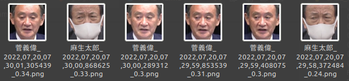
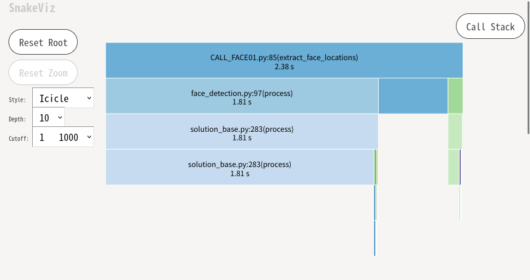
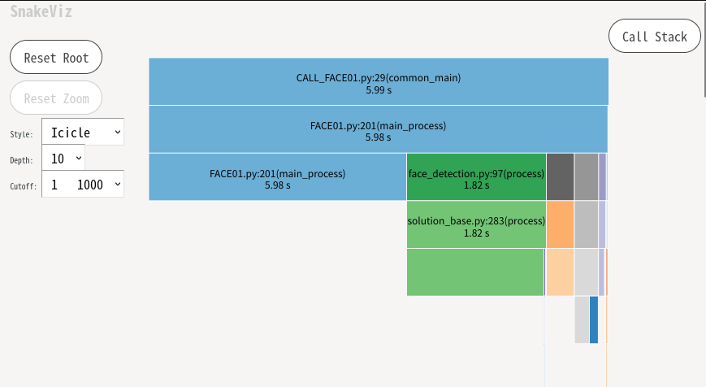
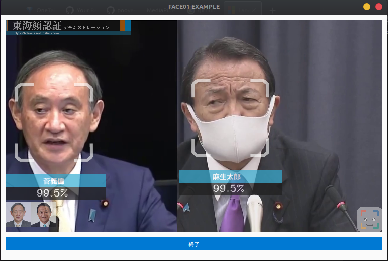
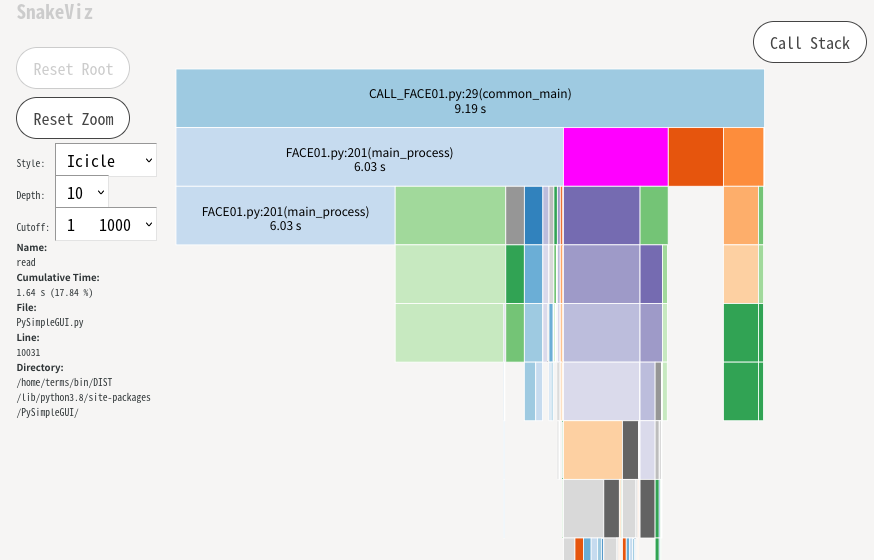

# FACE01 SAMPLE
This repository contains FACE01 SAMPLE for UBUNTU 20.04.
This sample can be used until December 2022.

# Installation
`sudo bash -c 'INSTALL_FACE01.sh'`
NOTE: THIS IS *ONLY* USE FOR UBUNTU *20.04*
Alternatively, refer to INSTALL_FACE01.sh and install manually.
This installer creates Python virtual environment.

# Configuration
Edit `config.ini` file to configure FACE01.

# Example
`python CALL_FACE01.py`
See `CALL_FACE01.py` to refer the entire code.
## If you want to extract only face coordinates
Set `headless = True` on `config.ini`.

## Import FACE01
```python
import cProfile as pr
import PySimpleGUI as sg
import cv2
import time
from face01lib.video_capture import VidCap 
from memory_profiler import profile  # If you want to use @profile()
from sys import exit

import FACE01 as fg
```
## Set the number of playback frames
If you just want to try FACE01 a bit, you can limit the number of frames it loads.
```python
exec_times: int = 50
ALL_FRAME = exec_times
```
```python
next_frame_gen_obj = VidCap().frame_generator(fg.args_dict)
def extract_face_locations(exec_times):
    profile_HANDLING_FRAME_TIME_FRONT = time.perf_counter()
    i: int = 0
    for i in range(exec_times):
        i += 1
        if i >= exec_times:
            break
        next_frame = next_frame_gen_obj.__next__()
        frame_datas_array = fg.Core().frame_pre_processing(fg.logger, fg.args_dict,next_frame)
        for frame_datas in frame_datas_array:
            for face_location in frame_datas["face_location_list"]:
                print(face_location)
    
    print('Finish profiling')
    profile_HANDLING_FRAME_TIME_REAR = time.perf_counter()
    profile_HANDLING_FRAME_TIME = (profile_HANDLING_FRAME_TIME_REAR - profile_HANDLING_FRAME_TIME_FRONT) 
    print(f'Predetermined number of frames: {ALL_FRAME}')
    print(f'Number of frames processed: {i}')
    print(f'Total processing time: {round(profile_HANDLING_FRAME_TIME , 3)}[seconds]')
    print(f'Per frame: {round(profile_HANDLING_FRAME_TIME / i, 3)}[seconds]')
pr.run('extract_face_locations(exec_times)', 'restats')
```
## Result
```bash
...
(113, 522, 270, 365)
(124, 198, 281, 41)
(115, 525, 274, 366)
(114, 528, 276, 366)
(124, 199, 283, 40)
(115, 528, 276, 367)
(122, 200, 283, 39)
Finish profiling
Predetermined number of frames: 50
Number of frames processed: 50
Total processing time: 2.353[second]
Per frame: 0.047[second]
```
The face images are output to the `/output/` folder.

You can see the profile result.
`snakeviz restats`
```bash
snakeviz restats
```


## If you want to face recognition
Set `headless = True` on `config.ini`.
```python
def common_main(exec_times):
    profile_HANDLING_FRAME_TIME_FRONT = time.perf_counter()
    event = ''
    while True:
        try:
            frame_datas_array = fg.main_process().__next__()
        except Exception as e:
            print(e)
            exit(0)
        exec_times = exec_times - 1
        if  exec_times <= 0:
            break
        else:
            print(f'exec_times: {exec_times}')
            if fg.args_dict["headless"] == False:
                event, _ = window.read(timeout = 1)
                if event == sg.WIN_CLOSED:
                    print("The window was closed manually")
                    break
            for frame_datas in frame_datas_array:
                if "face_location_list" in frame_datas:
                    img, face_location_list, overlay, person_data_list = \
                        frame_datas['img'], frame_datas["face_location_list"], frame_datas["overlay"], frame_datas['person_data_list']
                    for person_data in person_data_list:
                        name, pict, date,  location, percentage_and_symbol = \
                            person_data['name'], person_data['pict'], person_data['date'],  person_data['location'], person_data['percentage_and_symbol']
                        if not name == 'Unknown':
                            print(
                                name, "\n",
                                "\t", "similarity\t", percentage_and_symbol, "\n",
                                "\t", "coordinate\t", location, "\n",
                                "\t", "time\t", date, "\n",
                                "\t", "output\t", pict, "\n",
                                "-------\n"
                            )
                    if fg.args_dict["headless"] == False:
                        imgbytes = cv2.imencode(".png", img)[1].tobytes()
                        window["display"].update(data = imgbytes)
        if fg.args_dict["headless"] == False:
            if event =='terminate':
                break
    if fg.args_dict["headless"] == False:
        window.close()
    
    profile_HANDLING_FRAME_TIME_REAR = time.perf_counter()
    profile_HANDLING_FRAME_TIME = (profile_HANDLING_FRAME_TIME_REAR - profile_HANDLING_FRAME_TIME_FRONT) 
    print(f'Predetermined number of frames: {ALL_FRAME}')
    print(f'Number of frames processed: {ALL_FRAME - exec_times}')
    print(f'Total processing time: {round(profile_HANDLING_FRAME_TIME , 3)}[seconds]')
    print(f'Per frame: {round(profile_HANDLING_FRAME_TIME / (ALL_FRAME - exec_times), 3)}[seconds]')
pr.run('common_main(exec_times)', 'restats')
```

## Result
```bash
...
exec_times: 2
麻生太郎 
         similarity      99.1% 
         coordinate      (114, 528, 276, 366) 
         time    2022,07,20,07,14,56,229442 
         output  output/麻生太郎_2022,07,20,07,14,56,254172_0.39.png 
 -------

菅義偉 
         similarity      99.3% 
         coordinate      (124, 199, 283, 40) 
         time    2022,07,20,07,14,56,229442 
         output  output/麻生太郎_2022,07,20,07,14,56,254172_0.39.png 
 -------

exec_times: 1
麻生太郎 
         similarity      99.3% 
         coordinate      (115, 528, 276, 367) 
         time    2022,07,20,07,14,56,340726 
         output   
 -------

菅義偉 
         similarity      99.3% 
         coordinate      (122, 200, 283, 39) 
         time    2022,07,20,07,14,56,340726 
         output   
 -------

Predetermined number of frames: 50
Number of frames processed: 50
Total processing time: 5.994[seconds]
Per frame: 0.12[seconds]
```
You can see the profile result.
`snakeviz restats`
```bash
snakeviz restats
```


## If you want to display GUI window.
The processing speed will be slower, but you can use the GUI to display the window.
Set `headless = False` on `config.ini`.
```python
# PySimpleGUI layout
sg.theme('LightGray')
if fg.args_dict["headless"] == False:
    layout = [
        [sg.Image(filename='', key='display', pad=(0,0))],
        [sg.Button('terminate', key='terminate', pad=(0,10), expand_x=True)]
    ]
    window = sg.Window(
        'FACE01 EXAMPLE', layout, alpha_channel = 1, margins=(10, 10),
        location=(0,0), modal = True, titlebar_icon="./images/g1320.png", icon="./images/g1320.png"
    )
```
## Result
```bash
...
 -------

exec_times: 1
麻生太郎 
         similarity      99.2% 
         coordinate      (113, 529, 277, 365) 
         time    2022,07,20,07,30,01,276896 
         output   
 -------

菅義偉 
         similarity      99.3% 
         coordinate      (122, 200, 283, 39) 
         time    2022,07,20,07,30,01,276896 
         output  output/菅義偉_2022,07,20,07,30,01,305439_0.34.png 
 -------

Predetermined number of frames: 50
Number of frames processed: 50
Total processing time: 9.186[seconds]
Per frame: 0.184[seconds]
```



# References
1. [dlib](https://github.com/davisking/dlib)
2. [face_recognition](https://github.com/ageitgey/face_recognition)
3. [mediapipe](https://github.com/google/mediapipe)

