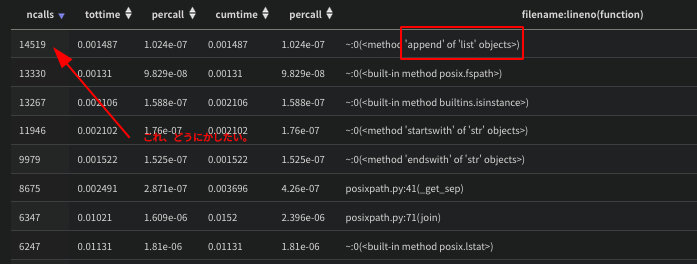
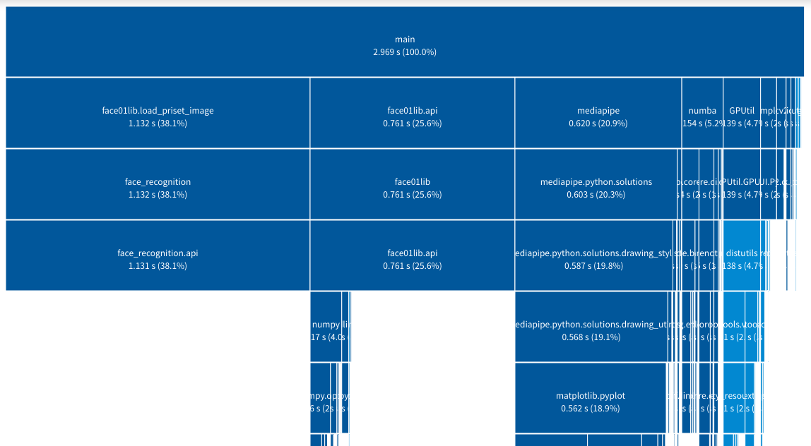
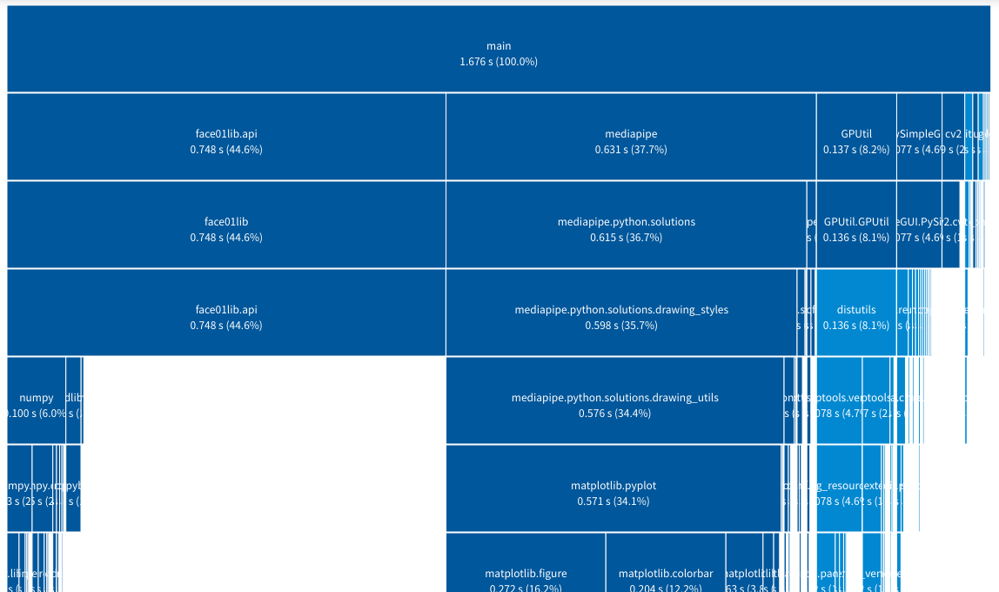
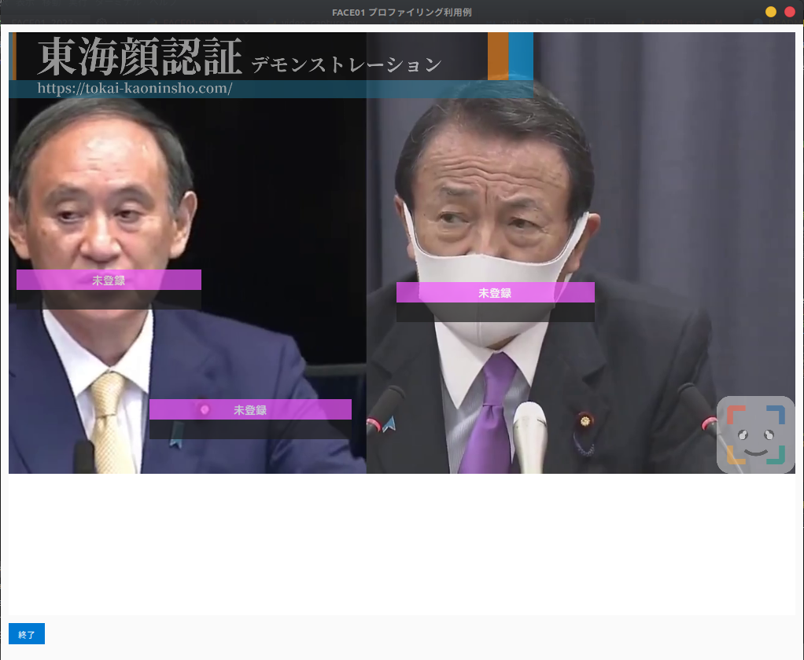
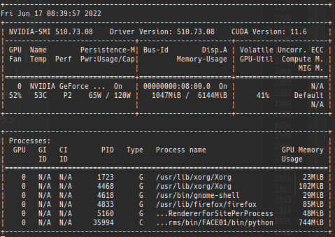
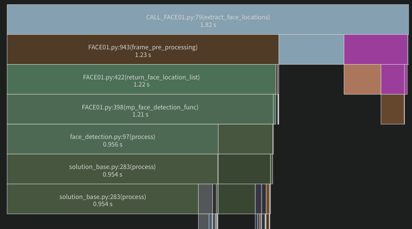
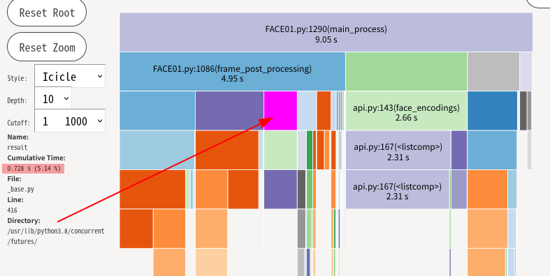
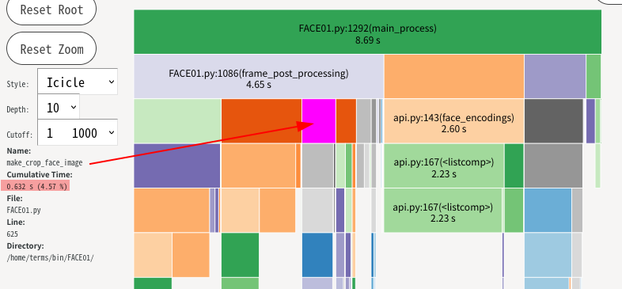
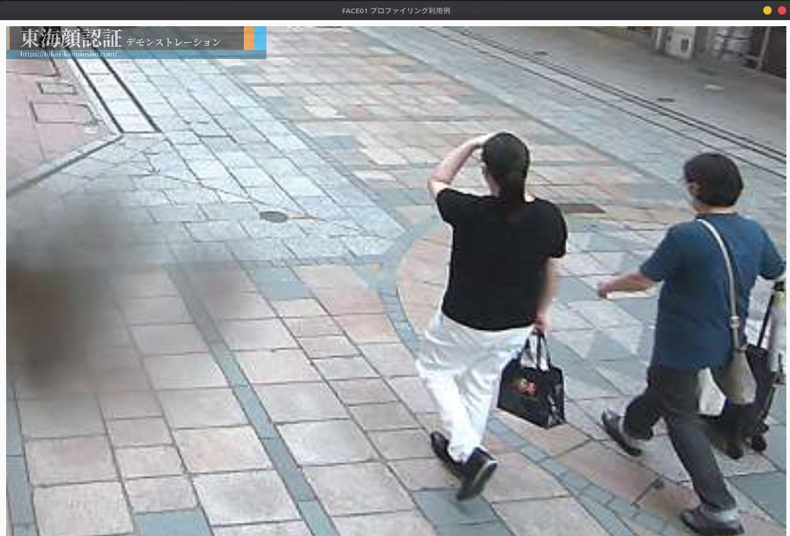

# FACE01について
## 1.3.09実装予定
# TODO
## 他
- appendを解決する
  
- ctypesでC言語と連携
- プロセス間通信の調査
  - FACE01自体の開発より、FACE01がどのようにして他のアプリケーションに情報を伝えるのか考えないといけない。
- ドキュメントをすこしずつでも書く
- 使用するフォントをOS標準にする
  - UbuntuならNotoフォントとか。
- face01lib/__init__の編集
- マルチプロセス化
  - `frame = video_capture(args_dict["kaoninshoDir"], args_dict["movie"]).__next__()`でフレームを一つ取り出したら、それ以降は一つの関数で良い。そのうえで、その関数をマルチプロセス化する。
    - face_encodings()はマルチプロセス化できない。dlib仕様。←[face_recognition](https://github.com/ageitgey/face_recognition/blob/87a8449a359fbc0598e95b820e920ce285b8a9d9/face_recognition/face_recognition_cli.py#L42) を参考にすると良いかもしれない。
  - mediapipeをより深く調査
    - GPU使用化
    - logの吐き方
  - help実装
    - click, argparseどちらがいいのか調査
- 何回も再計算している箇所を効率化する
  - numbaをもっと調査
- ライブラリの内包化(FACE01自身に持つようにする)
  - PySimpleGUI以外
  - インストール負担軽減と使用ライブラリ隠蔽化
- GPU環境識別system_check()
  - config.iniで設定可能にする
  - 同じマシンで何度も実行しないようにロックファイルを作るようにする
- main関数のさらなる関数細分化
- frame_skip変数 半自動設定
- PySimpleGUIをTkinterへ差し替え
- 関数のマルチスレッド化
- faceapi.compare_facesとreturn_face_namesに冗長がある
  - 調査
    - mathライブラリ
    - numpy化
- load_priset_image.py
  - リファクタリング
  - マルチプロセス化
- opencv
  - pip -> system install
  - USE GPU
  - libopencv-calib3d4.2コンピュータビジョンカメラ較正ライブラリ
- Python3-vlc調査
- exit()やquit()をどうにかする
- Python3.8までは、__file__で得られるのはpythonコマンド（環境によってはpython3コマンド）の実行時に指定したパス。相対パスで指定した場合は相対パス、絶対パスで指定した場合は絶対パスが返される。Python3.9以降は、実行時に指定したパスによらず絶対パスが返される。
  - `python ./FACE01.py`ではエラーになる
    - `python /home/terms/bin/FACE01/FACE01.py`絶対パスならOKということ

# 実装完了
- main関数化
  - main_process()にした
- config.iniリファクタリング
- configparser部分を関数化
  - returnは辞書形式で。
- Pythonバージョン確認コード実装
- telopとlogoをもっと小さく。
## 1.3.04で実装
- Logging
  - [logging --- Python 用ロギング機能](https://docs.python.org/ja/3.8/library/logging.html)
  - [logging.config --- ロギングの環境設定](https://docs.python.org/ja/3.8/library/logging.config.html)
  - ハンドラーなどは1.3.04では実装しない。
  - stdout, stderrなども考慮されていない

  ```python
  # see bellow
  # https://github.com/ageitgey/medium_to_ghost/blob/0403e8e7b005e1b5af78b4ae58199d3b513416cc/medium_to_ghost/medium_to_ghost.py
  import logging
  logging.basicConfig(stream=sys.stdout, level=logging.DEBUG)
  logger = logging.getLogger('medium_to_ghost')

  shutil.make_archive("medium_export_for_ghost", "zip", "exported_content", logger=logger)
  logger.info(f"Successfully created medium_export_for_ghost.zip. Upload this file to a Ghost 2.0+ instance!")
  ```

## 1.3.05で実装完了
  - 起動時間短縮
    - ボトルネックになっている箇所を調査
      - [Pythonのスタートアップ時間を可視化した](https://www.kurusugawa.jp/show-python-import-start-time/)
```bash
/home/terms/bin/FACE01/bin/python -X importtime  /home/terms/bin/FACE01/FACE01.py > /dev/null
```
```bash
pip install tuna
python -X importtime your/script.py 2> a.log 
tuna a.log
```
### 対応方法
import文をできる限りfrom importへ変更。
### 対応前
2.96秒

### 対応後
1.67秒


## 1.3.06で実装完了
  - ボトムエリア描画機能廃止
    - ボトムエリア描画機能に対応するコードを削除
    - 理由
      - 
      - 単純に一般の描画機能と描画処理のコーディングが混じってしまって複雑になり、仕様者にとって分かりづらくなっている
      - 描画機能自体は確認用のおまけであるから、ボトムエリアを含むタブレット端末のようなもので顔認証するなら、外部のソフトウェアで実現するべきと考えるから。
    - config.iniの修正：OK
    - FACE01.pyの修正：OK


## 1.3.07で実装完了
- 実装完了というより、以後に課題を残す結果となった。
### メモリ消費のポイントを探す
#### 手順
- ボトルネックを探すモジュール
  - 標準モジュール
    - tracemalloc
      - [標準モジュールでのメモリ追跡の方法](https://tkkm.tokyo/post-329/)
      - [tracemalloc --- メモリ割り当ての追跡](https://docs.python.org/ja/3.8/library/tracemalloc.html)
    - guppy
      - [Pythonのメモリ使用量を減らすポイント](https://qiita.com/yukinoi/items/59d43a3ee207c8aad35b)
    - memory_profiler
      - [[python]変数のメモリ消費量確認](https://qiita.com/kpasso1015/items/83062ac14c3c44907e5b#memory_profiler)
      - [Python: memory_profiler でプログラムのメモリ使用量を調べる](https://blog.amedama.jp/entry/2018/02/04/001950)
- Pythonのメモリ削減の考え方
  - [【python】pythonでメモリ不足になったときにすること](https://www.haya-programming.com/entry/2017/02/09/190512)
  - [Pythonでメモリを食い過ぎた時に見直すポイント](https://nishiohirokazu.hatenadiary.org/entry/20121012/1350045654)
- 実際の手順
  - memory_profilerをpipインストール
  - FACE01の__name__ == __main__以下に@profileを挿入
    ```python
    from memory_profiler import profile
    @profile()
    def profile(exec_times):
      以下略
    ```
##### 実行結果
-  @profile()
   ```bash
   PYDEV DEBUGGER WARNING:中略

   Line #    Mem usage    Increment  Occurrences   Line Contents
   =============================================================
     1034   1906.8 MiB   1563.9 MiB           1                   face_encodings = faceapi.face_encodings(resized_frame, face_location_list, args_dict["jitters"], args_dict["model"])
     1005   1964.9 MiB   1964.9 MiB           1   @profile()
     1006                                         def face_encoding_process(args_dict, frame_datas_array):
   その他略
   ```
   ほぼすべての関数に@profile()デコレータをつけた結果が上。
   face_encodingsに絡んでいるものだけしかメモリ使用量が増加していなかった。
  変数.__sizeof__()
   - args_dict.__sizeof__(): 2256
   -  modified_frame_list: 72
   -  5500枚の顔写真を登録した状態にしたところメモリは以下のようになり、あまり変化がないことが分かった。これは予想外。
      - args_dict.__sizeof__(): 2256MB
      - modified_frame_list.__sizeof__(): 72MB
- GPU使用率の変化
   `nvidia-smi -lms 500  # 500msごと`
   
#### 考察
変数args_dictのメモリ使用量は登録者人数を増やせばもっともっと増えると思ったけど違った。
メモリ使用量削減するなら、もっと時間をかけた調査が必要。
- 線形探索[Pythonで実践する線形探索と選択ソート 『Pythonではじめるアルゴリズム入門』より](https://codezine.jp/article/detail/11914)
> エントリの個数とアクセス頻度によってはO(n)で線形探索したほうがよっぽどよい。
> [辞書を大量に使ってはいけない](https://nishiohirokazu.hatenadiary.org/entry/20121012/1350045654)

> 私は癖で「配列の形をlistで作ってからnumpy配列に変換する」という処理を良く書くのですが、その度にその配列のメモリ消費が半分近く減少するという経験をしています。
> これはある意味当たり前のことで、そもそもリスト構造はポインタの塊なので、データの中身を記録するのと同じくらいのメモリ領域をアドレスデータを持つことに費やしています。numpy配列はリストと比べればだいぶ効率的なデータ構造をしているので、これを使ってメモリ消費が小さくなるのは当然です。
> [リストは積極的にnumpy配列にする](https://www.haya-programming.com/entry/2017/02/09/190512#%E3%83%AA%E3%82%B9%E3%83%88%E3%81%AF%E7%A9%8D%E6%A5%B5%E7%9A%84%E3%81%ABnumpy%E9%85%8D%E5%88%97%E3%81%AB%E3%81%99%E3%82%8B)

#### CALL_FACE01.pyを作ってメモリ・処理時間調査
```bash
fg.args_dict.__sizeof__(): 1160MB
(124, 145, 259, 10)
(295, 246, 426, 115)
(97, 516, 259, 354)
Filename: /home/terms/bin/FACE01/CALL_FACE01.py

Line #    Mem usage    Increment  Occurrences   Line Contents
=============================================================
    79    300.6 MiB    300.6 MiB           1   @profile()
    80                                         def extract_face_locations(exec_times):
    81    780.5 MiB      0.0 MiB         101       for i in range(exec_times):
    82    776.4 MiB      0.0 MiB         100           i += 1
    83    776.4 MiB      0.0 MiB         100           if i > exec_times:
    84                                                     break
    85    776.4 MiB     49.1 MiB         100           next_frame = next_frame_gen_obj.__next__()
    86                                                 """DEBUG"""
    87                                                 # fg.frame_imshow_for_debug(next_frame)
    88    776.4 MiB      0.0 MiB         100           print(f"fg.args_dict.__sizeof__(): {fg.args_dict.__sizeof__()}MB")
    89    780.5 MiB    430.9 MiB         100           frame_datas_array = fg.frame_pre_processing(fg.args_dict,next_frame)
    90    780.5 MiB      0.0 MiB         200           for frame_datas in frame_datas_array:
    91    780.5 MiB      0.0 MiB         349               for face_location in frame_datas["face_location_list"]:
    92    780.5 MiB      0.0 MiB         249                   print(face_location)
```



### 計算式の効率化
- 数値計算をなるべくnumpyに移行する
  - あまり高速化には寄与しないかもしれないけれど、動的型付けによる計算処理はモヤモヤする。
  - [NumPyまとめ](https://note.nkmk.me/numpy/)
  - [数値計算 numpy google検索](https://www.google.com/search?q=%E6%95%B0%E5%80%A4%E8%A8%88%E7%AE%97%20numpy&ie=utf-8&oe=utf-8&client=firefox-b-m)
- 複数回計算している関数名をピックアップする
  - return_face_location_list
  - return_concatenate_location_and_frame
  - adjust_display_area
  - draw_default_face_image
  - calculate_text_position
  - draw_error_messg_rectangle
  - decide_text_position
  - return_percentage
  - Measure_processing_time
#### 考察
- 可読性が悪くなる、返り値がnp.ndarrayになってしまうなど副作用が大きい割には計算コストがあまり変わらないため、numbaなどを使用する以外はやめた方がよい、と感じた。
- numpy化する時、配列の要素全てに計算を割り当てるから、個別の計算をコードするのはコストが悪い。

### loggingにおけるstdout, stderrを明確にする
  - [Pythonのlogging入門](https://qiita.com/papi_tokei/items/6051cb55c2843b2c3cdf)
    > これは、loggingソースコード内のlastResort(日本語で最後の手段という意味)という部分で定義されており、ロガーにハンドラーが一つもない場合、標準出力にWARNING以上のログを出力する、という実装になっているからです。
    > つまり、ハンドラーを設定しなくてもWARNING以上のログはデフォルトで出力されるが、バグのもとなのでこの実装を当てにしてはいけません。
  - [便利なハンドラ](https://docs.python.org/ja/3/howto/logging.html#useful-handlers)
  - [複数の出力先にログを出力する](https://docs.python.org/ja/3/howto/logging-cookbook.html#logging-to-multiple-destinations)
  ハンドラーについては実装した。

### ヘッドレス機能実装
- os.popenなどによるパイプ作成調査(fix)
  - subprocessモジュールが新しい代替
- imageデータを受け渡しする機能はつけないほうが良い
  - 元々の動画データをFACE01内で画像データ化しているのに、それをまたバイナリに戻して次のアプリケーションに渡す意味がない。
  - 顔座標は文字列で受け渡し可能だし、その方が普通のパイプで繋げられるから良い。
- FACE01のコマンド化
  - `/home/terms/bin/FACE01/bin/python3 "/home/terms/bin/FACE01/FACE01.py" | cat`でOK
  - あるいは`/home/terms/bin/FACE01/bin/python3 "/home/terms/bin/FACE01/CALL_FACE01.py" | cat`


## 1.3.08実装完了: Fix
- loggingの出力をしっかりと実装する
  - [Python Tutorial: Logging Advanced - Loggers, Handlers, and Formatters](https://www.youtube.com/watch?app=desktop&v=jxmzY9soFXg)
  - [inspect --- 活動中のオブジェクトの情報を取得する](https://docs.python.org/ja/3/library/inspect.html)
- 画像ファイル保存の非同期処理: Fix
  - [ThreadPoolExecutor の例](https://docs.python.org/ja/3/library/concurrent.futures.html#threadpoolexecutor-example)
  - 100frame処理した結果ではマルチスレッディングにしたほうが360ms高速だった。マルチスレッディングのコストは高い。
  - 
  - 
- video_capture.py
  - CGIストリームを受け付ける実装: Fix
    - 
  - RTSPを受け付けるように実装: Fix
    - [RTSP Stream for Testing](https://www.wowza.com/developer/rtsp-stream-test)
    - opencvの環境変数変更 要調査(video_capture.py)←やらない
  - イテレーターオブジェクトにしてframe送出自体をマルチスレッド化する←やらないことにした。

# 環境構築方法
## 開発想定環境
Distributor ID: Ubuntu
Description:    Ubuntu 20.04.4 LTS
Release:        20.04
Codename:       focal
Python 3.8.10
```bash
# System infomation
$ inxi -SCG
System:    Host: terms-Desks Kernel: 5.13.0-41-generic x86_64 bits: 64 Desktop: Gnome 3.36.9 
           Distro: Ubuntu 20.04.4 LTS (Focal Fossa) 
CPU:       Topology: Quad Core model: AMD Ryzen 5 1400 bits: 64 type: MT MCP L2 cache: 2048 KiB 
           Speed: 1375 MHz min/max: 1550/3200 MHz Core speeds (MHz): 1: 1375 2: 1397 3: 1375 4: 1375 5: 1374 6: 1378 7: 1374 
           8: 1453 
Graphics:  Device-1: NVIDIA TU116 [GeForce GTX 1660 Ti] driver: nvidia v: 510.47.03 
           Display: x11 server: X.Org 1.20.13 driver: fbdev,nouveau unloaded: modesetting,vesa resolution: 1440x900~60Hz 
           OpenGL: renderer: NVIDIA GeForce GTX 1660 Ti/PCIe/SSE2 v: 4.6.0 NVIDIA 510.47.03 

# System python version
$ python3 -V
Python 3.8.10
```
```python
> pip freeze
      absl-py==1.0.0
      attrs==21.4.0
      bandit==1.7.4
      click==8.1.3
      cycler==0.11.0
      Cython==0.29.28
      dlib==19.24.0
      fonttools==4.33.3
      gitdb==4.0.9
      GitPython==3.1.27
      GPUtil==1.4.0
      kiwisolver==1.4.2
      llvmlite==0.38.1
      matplotlib==3.5.2
      mediapipe==0.8.10
      mypy-extensions==0.4.3
      mypy==0.950
      numba==0.55.1(numbaをインストールする場合には通常のnumpyはアンインストールされる)
      numpy==1.21.6
      opencv-contrib-python==4.5.5.64
      opencv-python==4.5.5.64
      packaging==21.3
      pbr==5.9.0
      pep8==1.7.1
      Pillow==9.1.1
      pkg_resources==0.0.0
      protobuf==3.20.1
      pyparsing==3.0.9
      PySimpleGUI==4.60.0
      python-dateutil==2.8.2
      PyYAML==6.0
      six==1.16.0
      smmap==5.0.0
      snakeviz==2.1.1
      stevedore==3.5.0
      tk==0.1.0
      tomli==2.0.1
      tornado==6.1
      typing_extensions==4.2.0
      psutil==5.9.1

```
# 環境構築
## 参照
[Ubuntu 20.04 実行環境作成方法](https://tokai-kaoninsho.com/face-recognition-software/ubuntu-20-04-%e5%ae%9f%e8%a1%8c%e7%92%b0%e5%a2%83%e4%bd%9c%e6%88%90%e6%96%b9%e6%b3%95/)
## 必要なパッケージやライブラリのインストール
 ### apt install
```bash
# Install system software
$ sudo apt update && sudo apt upgrade -y
$ sudo apt install -y \
        build-essential \
        cmake \
        ffmpeg \
        fonts-mplus \
        libavcodec-dev \
        libavformat-dev \
        libcudnn8-dev \
        liblapack-dev \
        libopenblas-dev \
        libswscale-dev \
        libx11-dev \
        python3-dev \
        python3-tk \
        python3-venv 
```
### pip install
```python
$ python3 -V
Python 3.8.10
$ python3 -m venv ./
$ . bin/activate
(FACE01) 
$  pip -V
pip 20.0.2 from /home/terms/bin/FACE01/lib/python3.8/site-packages/pip (python 3.8)
(FACE01) 
$ pip install -U pip
[...]
      Successfully uninstalled pip-20.0.2
Successfully installed pip-22.1
(FACE01) 
$ pip install -U wheel
[...]
Successfully installed wheel-0.37.1
(FACE01) 
$ pip install -U setuptools
[...]
      Successfully uninstalled setuptools-44.0.0
Successfully installed setuptools-62.3.2
(FACE01) 
$ pip install -r requirements.txt 
[...]
$ python -V
Python 3.8.10
(FACE01) 
$ python
 [...]
>>> import dlib
>>> dlib.DLIB_USE_CUDA
True
>>> import tkinter
>>> 
```
# バージョン履歴
## version 1.3.02 Linux リリースノート
- mediapipeによる高速化
- face_recognitionライブラリの機能追加
  - インストール版を使用不可へ。
## version 1.3.01 Linux リリースノート
- リファクタリング
- 呼び出し方法の変更
## version 1.2.9 Linux & Windows リリースノート
- similar_percentageからtoleranceの算出をモジュール化してFACE01IMAGERでも使えるようになりました
- {name:default_image_ndarray}という辞書的変数を作りメモリに格納する→ver.1.2.9で実装完了

## version 1.2.8 Linux & Windows リリースノート
- face01lib128のload_priset_image.pyのバグフィックス→face01lib126は使用不可になりました
- バグフィックス
- 各機能をON/OFF変更可能に変更
- 複数顔検出機能追加
- face_learning機能の除去←復活させたい場合はver.127を参照
- tolerance指定をパーセント指定に変更
- 下部エリアを新設→顔認証専用タブレットのようなインターフェイスを選択可能に

## version 1.2.7 Linux & Windows リリースノート
- config_FACE01GRAPHICS127.iniによりEXE版のための外部からの変数変更を可能にした
- webカメラUSBデバイス番号の自動取得

## version 1.2.6 Linux & Windows リリースノート
- 顔が映っていない場合に発生する例外エラーをフィックス
- バグフィックスとそれによる呼び出し方法の変更
- パイプ機能をオミット

## version 1.2.5 Linux & Windows リリースノート
- マルチプロセスへ対応
- 引数→TrueからTrueへ変更
- 映像幅(setwidth)を変更可能化
- コメント削除→参照したい場合はver.124参照のこと
- 半自動フレームスキップ（マシンの処理速度に合わせる）

## 標準出力を日本語に。(python3系の場合）
- 標準出力のバッファリングをオフに
- sys.stdout = os.fdopen(sys.stdout.fileno(), 'w', buffering=1)