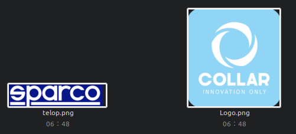
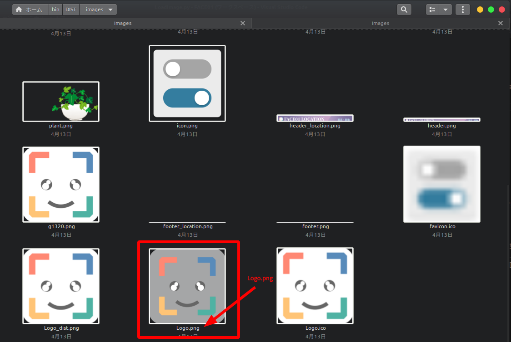
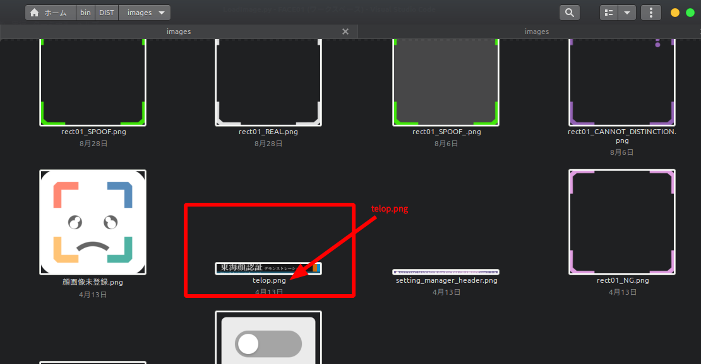
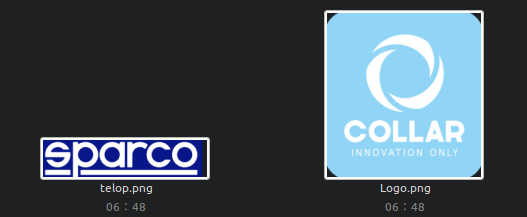
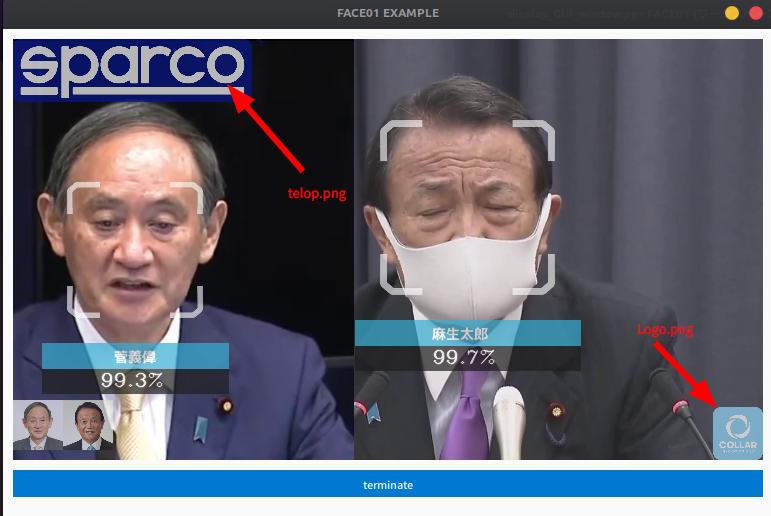

# Setting 'telop' and 'logo' images which you're company's.
Follow the steps below.

## 1. Prepare a new telop and logo image for replacement.

   

## 2. The telop and logo images are in `./images/`.

   
   

## 3. Replace 'telop.png' and 'Logo.png' images.

   

## 4. When you start the application after replacing these images, it will be drawn in the window.

   

# License

<a href="https://commons.wikimedia.org/wiki/File:SPARCO_COMPANY_LOGO.png">Sparco S.p.A</a>, <a href="https://creativecommons.org/licenses/by-sa/4.0">CC BY-SA 4.0</a>, via Wikimedia Commons

<a href="https://commons.wikimedia.org/wiki/File:COLLAR_Company_logo.jpg">Daria COLLAR</a>, <a href="https://creativecommons.org/licenses/by-sa/4.0">CC BY-SA 4.0</a>, via Wikimedia Commons