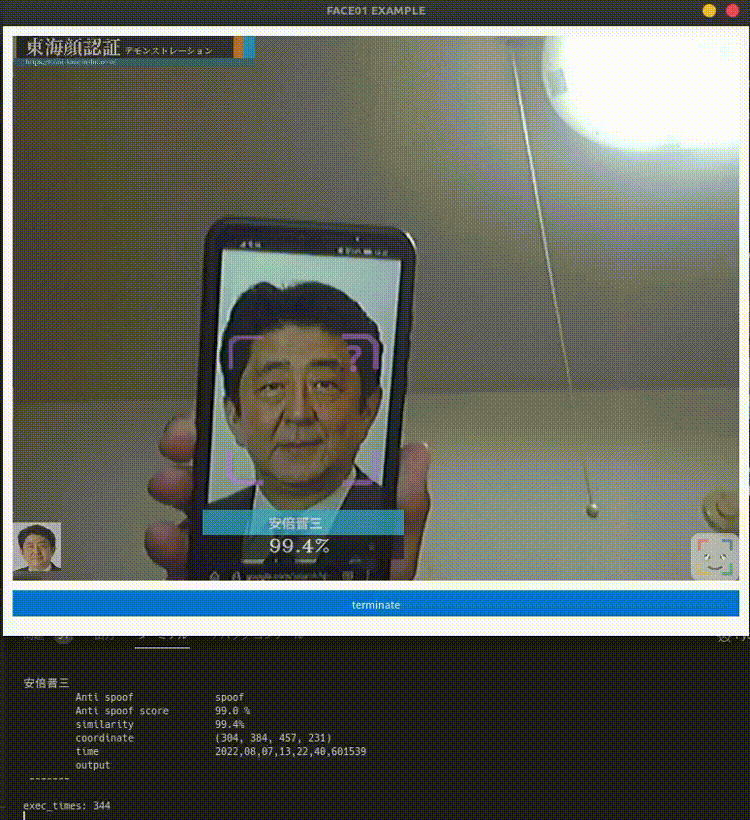

# To install Docker
See [here](Install_docker.md).

# Pull Docker image
The easiest way to use Docker is to pull the image.


```bash
# USE NVIDIA GPU
docker pull tokaikaoninsho/face01_gpu:1.4.08
# OR USE ONLY CPU
docker pull tokaikaoninsho/face01_no_gpu
```
## Use NVIDIA GPU
```bash
docker run --rm -it \
        --gpus all -e DISPLAY=$DISPLAY \
        --device /dev/video0:/dev/video0:mwr \
        -v /tmp/.X11-unix/:/tmp/.X11-unix: face01_gpu:1.4.08 

```
```bash
. bin/activate
python CALL_FACE01.py
```

## Only use CPU
```bash
docker run --rm -it \
        -e DISPLAY=$DISPLAY \
        --device /dev/video0:/dev/video0:mwr \
        -v /tmp/.X11-unix/:/tmp/.X11-unix: face01_no_gpu:1.4.08 

```
```bash
. bin/activate
python CALL_FACE01.py
```

# Build Docker image
If you want to build the Docker Image yourself,
See bellow.

First, you have to clone FACE01_SAMPLE repository.
```bash
git clone https://github.com/yKesamaru/FACE01_SAMPLE.git
```
## Build FACE01 docker image with nvidia-docker2 package
To make image
```bash
cd FACE01_SAMPLE
docker build -t face01_gpu:1.4.08 -f docker/Dockerfile_gpu . --network host

```

## Build FACE01 docker image * ***without*** * nvidia-docker2 package
```bash
cd FACE01_SAMPLE
docker build -t face01_no_gpu:1.4.08 -f docker/Dockerfile_no_gpu . --network host

```
## If you want to upload to you're own DockerHub
Reference is [here](https://docs.docker.com/docker-hub/repos/#pushing-a-docker-container-image-to-docker-hub).
Japanese is [here](https://zenn.dev/katan/articles/1d5ff92fd809e7).
```bash
# Built Docker Image
docker built ...
# Run Docker Image
docker run ...
# Confirm CONTAINER-ID
docker ps
# Confirm IMAGE-ID
docker images
# Commit container
docker container commit <container-id> <hub-user>/<repo-name>[:<tag>]
# Tag the Image with the repository name
docker tag <image-id> <repo-name>
# Docker loginr
docker login
# Docker push
docker push <hub-user>/<repo-name>[:<tag>]
```
## Check the completed image.
```bash
docker images
REPOSITORY    TAG                       IMAGE ID       CREATED         SIZE
face01_gpu    1.4.08                    41b1d82ee908   7 seconds ago   17.5GB
```
## Launch FACE01_SAMPLE
```bash
docker run --rm -it \
        --gpus all -e DISPLAY=$DISPLAY \
        --device /dev/video0:/dev/video0:mwr \
        -v /tmp/.X11-unix/:/tmp/.X11-unix: face01_gpu:1.4.08 

# Check nvidia-smi
docker@ee44d08e933f:~/FACE01_SAMPLE$ nvidia-smi
Fri Jul 29 09:07:03 2022       
+-----------------------------------------------------------------------------+
| NVIDIA-SMI 515.48.07    Driver Version: 515.48.07    CUDA Version: 11.7     |
|-------------------------------+----------------------+----------------------+
| GPU  Name        Persistence-M| Bus-Id        Disp.A | Volatile Uncorr. ECC |
| Fan  Temp  Perf  Pwr:Usage/Cap|         Memory-Usage | GPU-Util  Compute M. |
|                               |                      |               MIG M. |
|===============================+======================+======================|
|   0  NVIDIA GeForce ...  On   | 00000000:08:00.0  On |                  N/A |
| 41%   37C    P8    16W / 120W |    344MiB /  6144MiB |      5%      Default |
|                               |                      |                  N/A |
+-------------------------------+----------------------+----------------------+
                                                                               
+-----------------------------------------------------------------------------+
| Processes:                                                                  |
|  GPU   GI   CI        PID   Type   Process name                  GPU Memory |
|        ID   ID                                                   Usage      |
|=============================================================================|
+-----------------------------------------------------------------------------+
# Check files
docker@6ee18359bde8:~/FACE01_SAMPLE$  ls
CALL_FACE01.py            SystemCheckLock  dlib-19.24          images   lib64        output              requirements.txt  test.mp4
Docker_INSTALL_FACE01.sh  bin              dlib-19.24.tar.bz2  include  noFace       priset_face_images  share             顔無し区間を含んだテスト動画.mp4
FACE01.py                 config.ini       face01lib           lib      npKnown.npz  pyvenv.cfg          some_people.mp4
# Launch Python virtual environment (Important!)
docker@ee44d08e933f:~/FACE01_SAMPLE$ . bin/activate

```

# Start FACE01 example
## Dockerfile_gpu
This docker image is build with dockerfile named 'Dockerfile_gpu'.
```bash
# Launch Docker image
docker run --rm -it \
        --gpus all -e DISPLAY=$DISPLAY \
        --device /dev/video0:/dev/video0:mwr \
        -v /tmp/.X11-unix/:/tmp/.X11-unix: face01_gpu:1.4.08 

# Enter the Python virtual environment (IMPORTANT!)
docker@e85311b5908e:~/FACE01_SAMPLE$ . bin/activate
(FACE01_SAMPLE) docker@e85311b5908e:~/FACE01_SAMPLE$ 
# Launch FACE01_SAMPLE
(FACE01_SAMPLE) docker@e85311b5908e:~/FACE01_SAMPLE$ python CALL_FACE01.py
```
```bash
# Launch FACE01
(FACE01_SAMPLE) docker@ee44d08e933f:~/FACE01_SAMPLE$ python CALL_FACE01.py 
[2022-07-29 09:14:27,219] [face01lib/load_priset_image] [FACE01.py] [INFO] npKnown.npz を読み込みます
INFO: Created TensorFlow Lite XNNPACK delegate for CPU.
exec_times: 49
麻生太郎 
         Anti spoof              not_spoof 
         Anti spoof score        99.0 %
         similarity              99.4% 
         coordinate              (120, 577, 272, 425) 
         time                    2022,07,29,09,14,28,988774 
         output                   
 -------

[...]

exec_times: 1
麻生太郎 
         Anti spoof              not_spoof 
         Anti spoof score        89.0 %
         similarity              99.2% 
         coordinate              (113, 529, 277, 365) 
         time                    2022,07,29,09,14,37,115245 
         output                   
 -------

菅義偉 
         Anti spoof              spoof 
         Anti spoof score        89.0 %
         similarity              99.3% 
         coordinate              (122, 200, 283, 39) 
         time                    2022,07,29,09,14,37,115245 
         output                  output/菅義偉_2022,07,29,09,14,37,150428_0.34.png 
 -------

Predetermined number of frames: 50
Number of frames processed: 50
Total processing time: 9.75[seconds]
Per frame: 0.195[seconds]
```


## Dockerfile_no_gpu
```bash
# Launch Docker image
docker run --rm -it \
        -e DISPLAY=$DISPLAY \
        --device /dev/video0:/dev/video0:mwr \
        -v /tmp/.X11-unix/:/tmp/.X11-unix: face01_no_gpu:1.4.08 

# Enter the Python virtual environment (IMPORTANT!)
docker@e85311b5908e:~/FACE01_SAMPLE$ . bin/activate
(FACE01_SAMPLE) docker@e85311b5908e:~/FACE01_SAMPLE$ 
# Launch FACE01_SAMPLE
(FACE01_SAMPLE) docker@e85311b5908e:~/FACE01_SAMPLE$ python CALL_FACE01.py
```

[mp4 is here](https://user-images.githubusercontent.com/93259837/183275274-99f9d575-3c76-44a4-9da3-d14c8faf0370.mp4)
