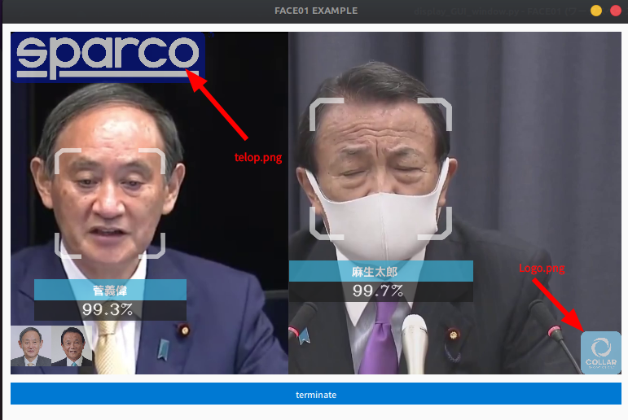

# If you want to get only face recognition
Don't forget to set `headless = True` on `config.ini`.

## Result
```bash

[2022-09-27 19:20:48,174] [face01lib.load_priset_image] [simple.py] [INFO] Loading npKnown.npz
菅義偉 
         similarity              99.1% 
         coordinate              (138, 240, 275, 104) 
         time                    2022,09,27,19,20,49,835926 
         output                   
 -------

麻生太郎 
         similarity              99.6% 
         coordinate              (125, 558, 261, 422) 
         time                    2022,09,27,19,20,49,835926 
         output                   
 -------
 ...

```

The face images are output to the `/output/` folder.


Try `example/benchmark_CUI.py` in the same examples folder.
You can see the profile result.
Your browser will automatically display a very cool and easy to use graph using `snakeviz`.

```bash
snakeviz restats
```


Whole example source code is [here](../example/benchmark_CUI.py).

```python
# Import FACE01 library
from face01lib.Core import Core
from face01lib.Initialize import Initialize
```

```python
"""Set the number of playback frames.
If you just want to try FACE01 a bit, you can limit the number of frames it loads."""

if __name__ == '__main__':
    main(exec_times = 5)
```

```python

def main(exec_times: int = 50):

    # Initialize
    CONFIG: Dict =  Initialize().initialize()

    # Make generator
    gen = Core().common_process(CONFIG)

    # Repeat 'exec_times' times
    for i in range(1, exec_times):

        # Call __next__() from the generator object
        frame_datas_array = gen.__next__()

        for frame_datas in frame_datas_array:
            
            for person_data in frame_datas['person_data_list']:
                if not person_data['name'] == 'Unknown':
                    print(
                        person_data['name'], "\n",
                        "\t", "similarity\t\t", person_data['percentage_and_symbol'], "\n",
                        "\t", "coordinate\t\t", person_data['location'], "\n",
                        "\t", "time\t\t\t", person_data['date'], "\n",
                        "\t", "output\t\t\t", person_data['pict'], "\n",
                        "-------\n"
                    )
```


# If you want to display GUI window
Want to display in a cool GUI window?
Try `example/benchmark_GUI_window.py`.

*Don't forget* to set `headless=True` on `config.ini`.

## Result
```bash
...
麻生太郎 
         similarity      99.1% 
         coordinate      (114, 528, 276, 366) 
         time    2022,07,20,07,14,56,229442 
         output  output/麻生太郎_2022,07,20,07,14,56,254172_0.39.png 
 -------

菅義偉 
         similarity      99.3% 
         coordinate      (124, 199, 283, 40) 
         time    2022,07,20,07,14,56,229442 
         output  output/麻生太郎_2022,07,20,07,14,56,254172_0.39.png 
 -------

...

```


## Example code
Whole example source code is [here](../example/benchmark_GUI_window.py).

```python
import cv2
import PySimpleGUI as sg

from face01lib.Core import Core
from face01lib.Initialize import Initialize


def main(exec_times: int = 50):

    # Initialize
    CONFIG: Dict =  Initialize().initialize()


    if CONFIG["headless"] == True:
        print("""
        For this example, set config.ini as follows.
            > [MAIN] 
            > headless = False
        """)
        exit()


    # Make PySimpleGUI layout
    sg.theme('LightGray')
    layout = [
        [sg.Image(filename='', key='display', pad=(0,0))],
        [sg.Button('terminate', key='terminate', pad=(0,10), expand_x=True)]
    ]
    window = sg.Window(
        'FACE01 EXAMPLE',
        layout, alpha_channel = 1,
        margins=(10, 10),
        location=(0, 0),
        modal = True,
        titlebar_icon="./images/g1320.png",
        icon="./images/g1320.png"
    )


    gen = Core().common_process(CONFIG)
    

    # Repeat 'exec_times' times
    for i in range(1, exec_times):

        # Call __next__() from the generator object
        frame_datas_array = gen.__next__()

        event, _ = window.read(timeout = 1)

        if event == sg.WIN_CLOSED:
            print("The window was closed manually")
            break

        for frame_datas in frame_datas_array:
            
            for person_data in frame_datas['person_data_list']:
                if not person_data['name'] == 'Unknown':
                    print(
                        person_data['name'], "\n",
                        "\t", "similarity\t\t", person_data['percentage_and_symbol'], "\n",
                        "\t", "coordinate\t\t", person_data['location'], "\n",
                        "\t", "time\t\t\t", person_data['date'], "\n",
                        "\t", "output\t\t\t", person_data['pict'], "\n",
                        "-------\n"
                    )
            
                imgbytes = cv2.imencode(".png", frame_datas['img'])[1].tobytes()
                window["display"].update(data = imgbytes)
            
        if event =='terminate':
            break
    window.close()


if __name__ == '__main__':
    main(exec_times = 50)
```


# Setting 'telop' and 'logo' images which you're company's.
Follow the steps below.

1. Prepare a new telop and logo image for replacement.
   

2. The telop and logo images are in `./images/`.
   
   

3. Replace 'telop.png' and 'Logo.png' images.
   

4. When you start the application after replacing these images, it will be drawn in the window.
   

