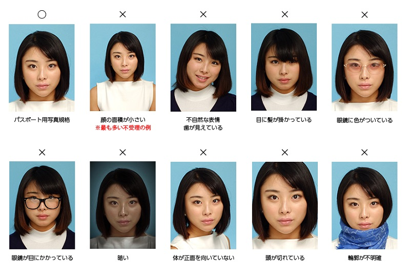
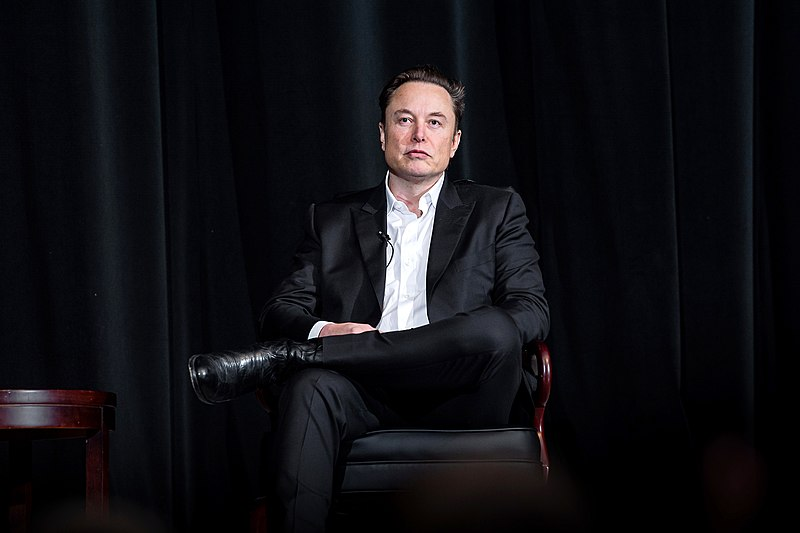
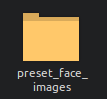
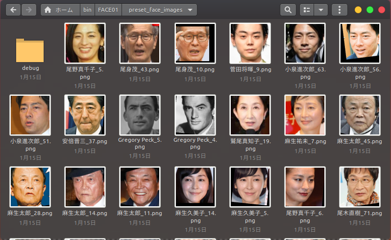

# Register face images

This article describes how to register face images.


## Basic knowledge of facial images
Just like your passport photo, it is important that the facial image you register is accurate.

> 
> quoted from [Russia Visa Center](https://visa.d2.r-cms.jp/)

When using on FACE01, make the *height 200px and width 200px*.

If you want to crop only the face part from the photo, it is very easy to use the `align_and_resize_maintain_aspect_ratio` method of the `Utils` class in FACE01.
```bash
python example/aligned_crop_face.py docs/img/Elon_Musk_Colorado_2022.jpg
```
- Original image
  - [U.S. Air Force photo by Trevor cokley](https://commons.wikimedia.org/wiki/File:Elon_Musk_Colorado_2022.jpg)
  
  

- Output face image
  

If a directory name is given as an argument, all image files in that directory will be targeted.

## Put face images in the `preset_images` folder.



When you start the application, it automatically converts the face image into 128D ndarray data.

ℹ️ **NOTE**
If you want to delete other face image files in the `preset_images` folder, move them to the `debug` folder before starting the application.



Just Done!
It's simple!