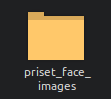
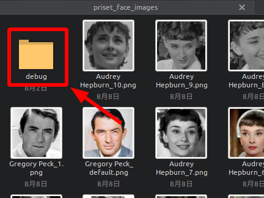

# Register face images

This article describes how to register face images.

## Basic knowledge of facial images
Just like your passport photo, it is important that the facial image you register is accurate.

> 
> quoted from [Russia Visa Center](https://visa.d2.r-cms.jp/)

When using on FACE01, make the *height 200px and width 200px*.

## Put face images in the `preset_images` folder.

When you start the application, it automatically converts the face image into 128D ndarray data.

**NOTE**
If you want to delete other face image files in the `preset_images` folder, move them to the `debug` folder before starting the application.

Just Done!
It's simple!