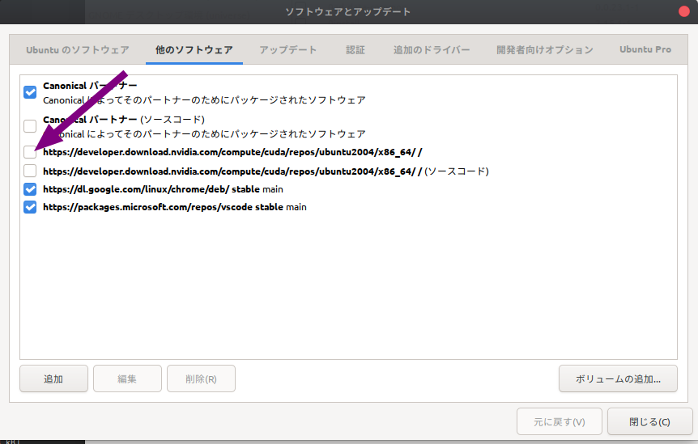
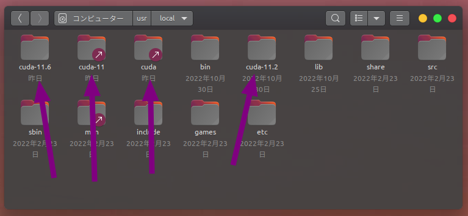
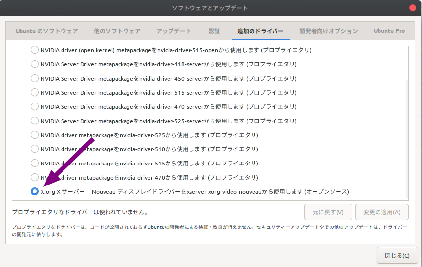
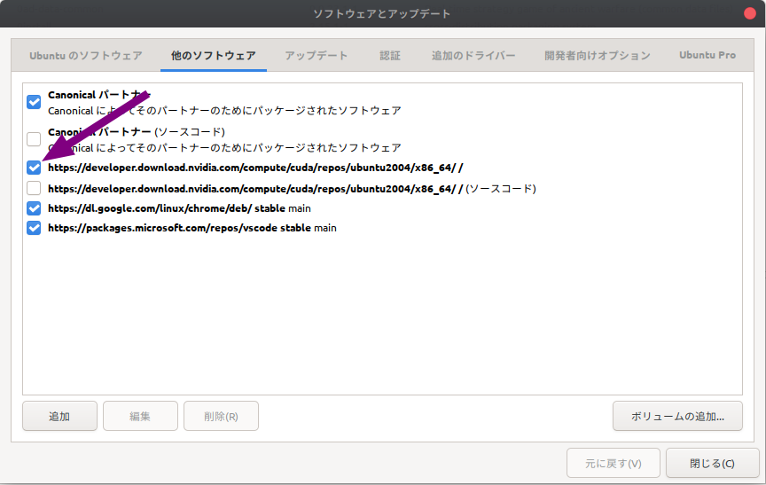
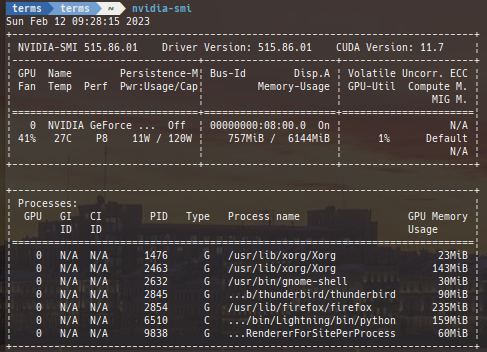

# Remove all cuda lib and re-install method
Due to frequent updates, CUDA may stop working if you are not careful when updating your system.

Here are the steps to resolve such situations.

## Remove all lib related to cuda
```bash
sudo apt purge cuda*
sudo apt purge libcuda*
sudo apt purge cudnn*
sudo apt purge libcudnn*
sudo apt-get purge *nvidia*

sudo apt autoremove
sudo apt autoclean
```

## Uncheck nvidia repository


`sudo apt update`

## Remove cuda files


`sudo rm -rf /usr/local/cuda*`

`sudo apt update && sudo apt upgrade -y`

Make sure the driver is the Nouveau display driver.


## Delete docker images
Check the current docker image.
```bash
$ docker images
 REPOSITORY                     TAG                       IMAGE ID       CREATED        SIZE
<none>                         <none>                    7015867e0ff7   2 weeks ago    18.2GB
tokaikaoninsho/face01_no_gpu   1.4.12                    dd34d05422c5   2 weeks ago    2.53GB
tokaikaoninsho/face01_gpu      1.4.12                    61d32d36b9ab   2 weeks ago    19.2GB
tokaikaoninsho/face01_no_gpu   1.4.11                    6ad4ba3cbe88   3 weeks ago    3.65GB
tokaikaoninsho/face01_gpu      1.4.11                    682da444845a   3 weeks ago    20.3GB
face01_no_gpu                  1.4.11                    efc3845d390a   3 weeks ago    2.5GB
face01_gpu                     1.4.11                    7398d955d905   3 weeks ago    19.2GB
<none>                         <none>                    6c61d0364450   3 weeks ago    1.66GB
<none>                         <none>                    b2e38e65b233   3 weeks ago    18.2GB
ubuntu                         20.04                     d5447fc01ae6   2 months ago   72.8MB
tensorflow/tensorflow          latest-gpu-jupyter        cf6cb74c9ec4   5 months ago   6.19GB
nvidia/cuda                    11.0.3-base-ubuntu20.04   8017f5c31b74   6 months ago   122MB
```
Delete docker images.
```bash
$ docker rmi 7015867e0ff7 dd34d05422c5 61d32d36b9ab 6ad4ba3cbe88 682da444845a efc3845d390a 7398d955d905 6c61d0364450 b2e38e65b233 d5447fc01ae6 cf6cb74c9ec4 8017f5c31b74
$ docker images
REPOSITORY              TAG                       IMAGE ID       CREATED        SIZE
<none>                  <none>                    7015867e0ff7   2 weeks ago    18.2GB
tensorflow/tensorflow   latest-gpu-jupyter        cf6cb74c9ec4   5 months ago   6.19GB
nvidia/cuda             11.0.3-base-ubuntu20.04   8017f5c31b74   6 months ago   122MB
$ docker rmi -f nvidia/cuda:11.0.3-base-ubuntu20.04
Untagged: nvidia/cuda:11.0.3-base-ubuntu20.04
Untagged: nvidia/cuda@sha256:57455121f3393b7ed9e5a0bc2b046f57ee7187ea9ec562a7d17bf8c97174040d
```
Remove docker images with `-f` option that cannot be removed.
```bash
$ docker rmi -f tensorflow/tensorflow:latest-gpu-jupyter
Untagged: tensorflow/tensorflow:latest-gpu-jupyter
Untagged: tensorflow/tensorflow@sha256:a72deb34d32e26cf4253608b0e86ebb4e5079633380c279418afb5a131c499d6
Deleted: sha256:cf6cb74c9ec4ff92634514468a6dd2323dead73720b58e1700b9478557668b3d
$ docker rmi -f 7015867e0ff7
Deleted: sha256:7015867e0ff7461e1776bfa43f7383f1a6ec748817e8afb60b04fce9f2b40cd8
Deleted: sha256:ae77d65add3126995cbfb38f7e8b36e12fa5f23de0ab7a9723b2a752cca3c281
Deleted: sha256:82eb8ba78e6c6d7f349188ba006b3e9f35b003e1682f3820355ab839bd5acd04
Deleted: sha256:f946ae5db3ab83a4da53d8791d7c57e7f6ad39bda37527e0338f82524791578f
Deleted: sha256:43707fb49b26719b6c92faf6af9fb2e160efa3ea9151cdc43c7fb903e61e7
```

Downloading the Docker public key, then set up it.
```bash
wget https://developer.download.nvidia.com/compute/cuda/repos/ubuntu2004/x86_64/cuda-keyring_1.0-1_all.deb

sudo dpkg -i cuda-keyring_1.0-1_all.deb
```
## Re-install lib
Tick nvidia repository.


```bash
sudo apt update
<!-- sudo apt install -y cuda -->
sudo apt install -y nvidia-cuda-toolkit
sudo apt install -y libcudnn8
sudo apt install -y libcudnn8-dev
<!-- sudo apt install -y libcublas -->
```
## Re-install driver
Check drivers.
```bash
sudo ubuntu-drivers devices
== /sys/devices/pci0000:00/0000:00:03.1/0000:08:00.0 ==
modalias : pci:v000010DEd00002182sv00001462sd00008D90bc03sc00i00
vendor   : NVIDIA Corporation
model    : TU116 [GeForce GTX 1660 Ti]
driver   : nvidia-driver-450 - third-party non-free
driver   : nvidia-driver-525-open - distro non-free recommended
driver   : nvidia-driver-460 - third-party non-free
driver   : nvidia-driver-515 - third-party non-free
driver   : nvidia-driver-418-server - distro non-free
driver   : nvidia-driver-455 - third-party non-free
driver   : nvidia-driver-470 - third-party non-free
driver   : nvidia-driver-450-server - distro non-free
driver   : nvidia-driver-515-open - distro non-free
driver   : nvidia-driver-520 - third-party non-free
driver   : nvidia-driver-495 - third-party non-free
driver   : nvidia-driver-515-server - distro non-free
driver   : nvidia-driver-470-server - distro non-free
driver   : nvidia-driver-510 - third-party non-free
driver   : nvidia-driver-465 - third-party non-free
driver   : nvidia-driver-525 - third-party non-free
driver   : nvidia-driver-525-server - distro non-free
driver   : xserver-xorg-video-nouveau - distro free builtin
```
Re-install driver.
```bash
sudo apt install nvidia-driver-515
パッケージリストを読み込んでいます... 完了
依存関係ツリーを作成しています                
状態情報を読み取っています... 完了
以下の追加パッケージがインストールされます:
  dctrl-tools dkms libegl-mesa0:i386 libegl1:i386 libgbm1:i386 libgles2:i386 libnvidia-cfg1-515
  libnvidia-common-515 libnvidia-compute-515 libnvidia-compute-515:i386 libnvidia-decode-515
  libnvidia-decode-515:i386 libnvidia-encode-515 libnvidia-encode-515:i386 libnvidia-extra-515
  libnvidia-fbc1-515 libnvidia-fbc1-515:i386 libnvidia-gl-515 libnvidia-gl-515:i386 libopengl0:i386
  libwayland-server0:i386 nvidia-compute-utils-515 nvidia-dkms-515 nvidia-kernel-common-515
  nvidia-kernel-source-515 nvidia-prime nvidia-settings nvidia-utils-515 screen-resolution-extra
  xserver-xorg-video-nvidia-515
提案パッケージ:
  debtags menu
以下のパッケージは「削除」されます:
  libnvidia-compute-418-server
以下のパッケージが新たにインストールされます:
  dctrl-tools dkms libegl-mesa0:i386 libegl1:i386 libgbm1:i386 libgles2:i386 libnvidia-cfg1-515
  libnvidia-common-515 libnvidia-compute-515 libnvidia-compute-515:i386 libnvidia-decode-515
  libnvidia-decode-515:i386 libnvidia-encode-515 libnvidia-encode-515:i386 libnvidia-extra-515
  libnvidia-fbc1-515 libnvidia-fbc1-515:i386 libnvidia-gl-515 libnvidia-gl-515:i386 libopengl0:i386
  libwayland-server0:i386 nvidia-compute-utils-515 nvidia-dkms-515 nvidia-driver-515 nvidia-kernel-common-515
  nvidia-kernel-source-515 nvidia-prime nvidia-settings nvidia-utils-515 screen-resolution-extra
  xserver-xorg-video-nvidia-515
アップグレード: 0 個、新規インストール: 31 個、削除: 1 個、保留: 0 個。
334 MB のアーカイブを取得する必要があります。
この操作後に追加で 778 MB のディスク容量が消費されます。
続行しますか? [Y/n] Y
```
Reload `~/.bashrc`.
`. .bashrc`

## Install Docker
```bash
sudo apt-get update && sudo apt-get upgrade -y \
  && curl https://get.docker.com | sh \
  && sudo systemctl --now enable docker
  
sudo usermod -aG docker <user_name>
distribution=$(. /etc/os-release;echo $ID$VERSION_ID) \
      && curl -fsSL https://nvidia.github.io/libnvidia-container/gpgkey | sudo gpg --dearmor -o /usr/share/keyrings/nvidia-container-toolkit-keyring.gpg \
      && curl -s -L https://nvidia.github.io/libnvidia-container/$distribution/libnvidia-container.list | \
            sed 's#deb https://#deb [signed-by=/usr/share/keyrings/nvidia-container-toolkit-keyring.gpg] https://#g' | \
            sudo tee /etc/apt/sources.list.d/nvidia-container-toolkit.list
sudo apt update
sudo apt-get update --fix-missing

sudo apt install -y nvidia-docker2
sudo systemctl restart docker
```

## Check with `nvidia-smi` command.


```bash
nvidia-smi 
Sun Feb 12 09:28:15 2023       
+-----------------------------------------------------------------------------+
| NVIDIA-SMI 515.86.01    Driver Version: 515.86.01    CUDA Version: 11.7     |
|-------------------------------+----------------------+----------------------+
| GPU  Name        Persistence-M| Bus-Id        Disp.A | Volatile Uncorr. ECC |
| Fan  Temp  Perf  Pwr:Usage/Cap|         Memory-Usage | GPU-Util  Compute M. |
|                               |                      |               MIG M. |
|===============================+======================+======================|
|   0  NVIDIA GeForce ...  Off  | 00000000:08:00.0  On |                  N/A |
| 41%   27C    P8    11W / 120W |    757MiB /  6144MiB |      1%      Default |
|                               |                      |                  N/A |
+-------------------------------+----------------------+----------------------+
                                                                               
+-----------------------------------------------------------------------------+
| Processes:                                                                  |
|  GPU   GI   CI        PID   Type   Process name                  GPU Memory |
|        ID   ID                                                   Usage      |
|=============================================================================|
|    0   N/A  N/A      1476      G   /usr/lib/xorg/Xorg                 23MiB |
|    0   N/A  N/A      2463      G   /usr/lib/xorg/Xorg                143MiB |
|    0   N/A  N/A      2632      G   /usr/bin/gnome-shell               30MiB |
|    0   N/A  N/A      2845      G   ...b/thunderbird/thunderbird       90MiB |
|    0   N/A  N/A      2854      G   /usr/lib/firefox/firefox          235MiB |
|    0   N/A  N/A      6510      C   .../bin/Lightning/bin/python      159MiB |
|    0   N/A  N/A      9838      G   ...RendererForSitePerProcess       60MiB |
+-----------------------------------------------------------------------------+
```
## After that...
Reinstall Python libraries related to GPU if necessary.
Operation is checked and the work is completed.