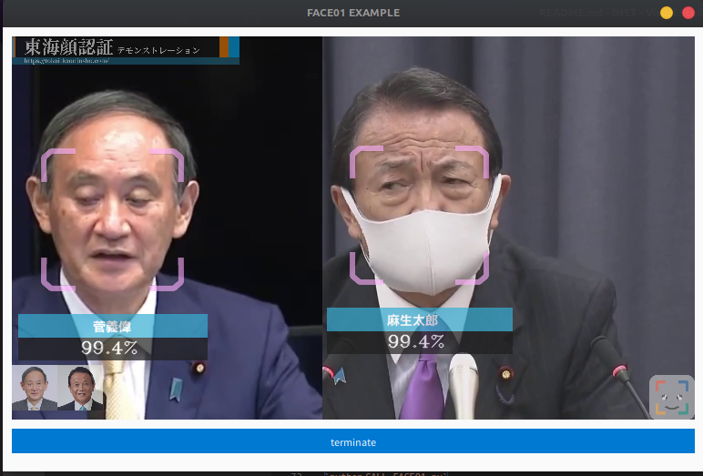

First, you have to clone FACE01_SAMPLE repository.
```bash
git clone https://github.com/yKesamaru/FACE01_SAMPLE.git
```
# To build FACE01 docker image with nvidia-docker2 package
## To make image
```bash
cd FACE01_SAMPLE
docker build -t face01_gpu:1.4.05 -f docker/Dockerfile_gpu . --network host
```

# Check the completed image.
```bash
docker images
REPOSITORY    TAG                       IMAGE ID       CREATED         SIZE
face01_gpu    1.4.05                    41b1d82ee908   7 seconds ago   17.5GB
```
# Launch FACE01_SAMPLE
```bash
docker run --rm -it \
        --gpus all -e DISPLAY=$DISPLAY \
        --device /dev/video0:/dev/video0:mwr \
        -v /tmp/.X11-unix/:/tmp/.X11-unix: face01_gpu:1.4.05 
# Check nvidia-smi
docker@ee44d08e933f:~/FACE01_SAMPLE$ nvidia-smi
Fri Jul 29 09:06:03 2022       
+-----------------------------------------------------------------------------+
| NVIDIA-SMI 515.48.07    Driver Version: 515.48.07    CUDA Version: 11.7     |
|-------------------------------+----------------------+----------------------+
| GPU  Name        Persistence-M| Bus-Id        Disp.A | Volatile Uncorr. ECC |
| Fan  Temp  Perf  Pwr:Usage/Cap|         Memory-Usage | GPU-Util  Compute M. |
|                               |                      |               MIG M. |
|===============================+======================+======================|
|   0  NVIDIA GeForce ...  On   | 00000000:08:00.0  On |                  N/A |
| 41%   37C    P8    16W / 120W |    344MiB /  6144MiB |      5%      Default |
|                               |                      |                  N/A |
+-------------------------------+----------------------+----------------------+
                                                                               
+-----------------------------------------------------------------------------+
| Processes:                                                                  |
|  GPU   GI   CI        PID   Type   Process name                  GPU Memory |
|        ID   ID                                                   Usage      |
|=============================================================================|
+-----------------------------------------------------------------------------+
# Check files
docker@6ee18359bde8:~/FACE01_SAMPLE$  ls
CALL_FACE01.py            SystemCheckLock  dlib-19.24          images   lib64        output              requirements.txt  test.mp4
Docker_INSTALL_FACE01.sh  bin              dlib-19.24.tar.bz2  include  noFace       priset_face_images  share             顔無し区間を含んだテスト動画.mp4
FACE01.py                 config.ini       face01lib           lib      npKnown.npz  pyvenv.cfg          some_people.mp4
# Launch Python virtual environment (Important!)
docker@ee44d08e933f:~/FACE01_SAMPLE$ . bin/activate
# Launch FACE01
(FACE01_SAMPLE) docker@ee44d08e933f:~/FACE01_SAMPLE$ python CALL_FACE01.py 
[2022-07-29 09:14:27,219] [face01lib/load_priset_image] [FACE01.py] [INFO] npKnown.npz を読み込みます
INFO: Created TensorFlow Lite XNNPACK delegate for CPU.
exec_times: 49
麻生太郎 
         Anti spoof              not_spoof 
         Anti spoof score        99.0 %
         similarity              99.4% 
         coordinate              (120, 577, 272, 425) 
         time                    2022,07,29,09,14,28,988774 
         output                   
 -------

[...]

exec_times: 1
麻生太郎 
         Anti spoof              not_spoof 
         Anti spoof score        89.0 %
         similarity              99.2% 
         coordinate              (113, 529, 277, 365) 
         time                    2022,07,29,09,14,37,115245 
         output                   
 -------

菅義偉 
         Anti spoof              spoof 
         Anti spoof score        89.0 %
         similarity              99.3% 
         coordinate              (122, 200, 283, 39) 
         time                    2022,07,29,09,14,37,115245 
         output                  output/菅義偉_2022,07,29,09,14,37,150428_0.34.png 
 -------

Predetermined number of frames: 50
Number of frames processed: 50
Total processing time: 9.75[seconds]
Per frame: 0.195[seconds]
```



# To build FACE01 docker image without nvidia-docker2 package
```bash
cd FACE01_SAMPLE
docker build -t face01_no_gpu:1.4.05 -f docker/Dockerfile_no_gpu . --network host
```