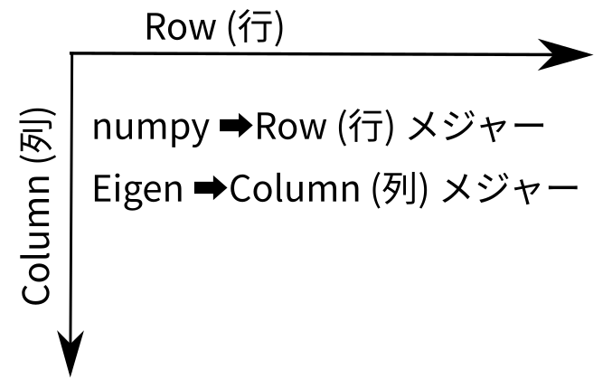

# numpy
## shape
> 各次元ごとの要素数
> See [here](https://deepage.net/features/numpy-shape.html).

## ndim
> 次元数
> See [here](https://deepage.net/features/numpy-axis.html#ndarray%E3%81%AE%E6%AC%A1%E5%85%83%E6%95%B0ndim%E3%81%A8%E3%81%AF%E4%BD%95%E3%81%8B).

## axis
> 座標軸。どの軸かを指定するための方法として、axisはshapeのインデックスに対応する。

## NumPy配列のスライシング
> 軸(axis)の番号が若いものから順に指定していきます。次元ごとには[:,:,:]のようにカンマ,で区切ります。
> See [here](https://deepage.net/features/numpy-slicing.html#%E5%A4%9A%E6%AC%A1%E5%85%83%E3%81%B8%E3%81%AE%E6%8B%A1%E5%BC%B5).


# numpyのスライスの挙動
```python
import numpy as np
start_stop = (0,3,0,3)
```
## 1次元のスライス
```python
dim1 = np.arange(10, dtype=np.uint8)

print(f'dim1: \n{dim1}\n')
dim1_slice = dim1[
    start_stop[0]:start_stop[1]
]
print(f'dim1_slice: \n{dim1_slice}\n')
print(f'dim1.ndim: {dim1.ndim}')
print(f'dim1.shape: {dim1.shape}')
print("-"*20, "\n")
```
```bash
dim1: 
[0 1 2 3 4 5 6 7 8 9]

dim1_slice: 
[0 1 2]

dim1.ndim: 1
dim1.shape: (10,)
-------------------- 
```

```python
dim1_not_T = dim1.T
print(f'dim1_not_T: \n{dim1_not_T}')
print("-"*20, "\n")
```
```bash
dim1_not_T: 
[0 1 2 3 4 5 6 7 8 9]
-------------------- 
```

```python
m1.reshape(-1,1)
print(f'dim1_T: \n{dim1_T}\n')
print(f'dim1_T.ndim: {dim1_T.ndim}')
print(f'dim1_T.shape: {dim1_T.shape}')
print("-"*20, "\n")
```
```bash
dim1_T: 
[[0]
 [1]
 [2]
 [3]
 [4]
 [5]
 [6]
 [7]
 [8]
 [9]]

dim1_T.ndim: 2
dim1_T.shape: (10, 1)
-------------------- 
```

```python
dim1_T_slice = dim1_T[
    start_stop[0]:start_stop[1]
]
print(f'dim1_T_slice: \n{dim1_T_slice}\n')
print(f'dim1_T.ndim: {dim1_T.ndim}')
print(f'dim1_T.shape: {dim1_T.shape}')
print("-"*20, "\n")

```
```bash
dim1_T_slice: 
[[0]
 [1]
 [2]]

dim1_T.ndim: 2
dim1_T.shape: (10, 1)
-------------------- 
```

```python
x = np.array([[[1],[2],[3]], [[4],[5],[6]]])

print(f'x: \n{x}\n')
```
```bash
x: 
[[[1]
  [2]
  [3]]

 [[4]
  [5]
  [6]]]
```

```python
x_slice = x[
    0:1,
    1:3,
    0:1
]
print(f'x.slice: \n{x_slice}\n')
print(f'x.ndim: {x.ndim}')
print(f'x.shape: {x.shape}')
print("-"*20, "\n")
```
```bash
x.slice: 
[[[2]
  [3]]]

x.ndim: 3
x.shape: (2, 3, 1)
-------------------- 
```

## 2次元のスライス
```python
dim2 = np.arange(16, dtype=uint8).reshape(4,4)
print(f'dim2: \n{dim2}\n')
```
```bash
dim2: 
[[ 0  1  2  3]
 [ 4  5  6  7]
 [ 8  9 10 11]
 [12 13 14 15]]
 ```

```python
dim2_slice_1 = dim2[
    start_stop[0]:start_stop[1],
    start_stop[2]:start_stop[3]
]
print(f'dim2_slice_1: \n{dim2_slice_1}\n')
print(f'dim2_slice_1.ndim: {dim2_slice_1.ndim}')
print(f'dim2_slice_1.ndim: {dim2_slice_1.ndim}')
print(f'dim2_slice_1.shape: {dim2_slice_1.shape}')
print("-"*20, "\n")
```
```bash
dim2_slice_1: 
[[ 0  1  2]
 [ 4  5  6]
 [ 8  9 10]]

dim2_slice_1.ndim: 2
dim2_slice_1.ndim: 2
dim2_slice_1.shape: (3, 3)
-------------------- 
```

```python
dim2_slice_2 = dim2[
    1:2,
    3:4
]
print(f'dim2_slice_2: \n{dim2_slice_2}\n')
print(f'dim2_slice_2.ndim: {dim2_slice_2.ndim}')
print(f'dim2_slice_2.ndim: {dim2_slice_2.ndim}')
print(f'dim2_slice_2.shape: {dim2_slice_2.shape}')
print("-"*20, "\n")
```
```bash
dim2_slice_2: 
[[7]]

dim2_slice_2.ndim: 2
dim2_slice_2.ndim: 2
dim2_slice_2.shape: (1, 1)
-------------------- 
```

## 3次元のスライス

```python
dim3 = np.arange(48, dtype=np.uint8).reshape(4,4,3)
print(f'dim3: \n{dim3}\n')
```
```bash
dim3: 
[[[ 0  1  2]
  [ 3  4  5]
  [ 6  7  8]
  [ 9 10 11]]

 [[12 13 14]
  [15 16 17]
  [18 19 20]
  [21 22 23]]

 [[24 25 26]
  [27 28 29]
  [30 31 32]
  [33 34 35]]

 [[36 37 38]
  [39 40 41]
  [42 43 44]
  [45 46 47]]]
  ```

```python
dim3_slice_1 = dim3[
    start_stop[0]:start_stop[1],
    start_stop[2]:start_stop[3]
]
print(f'dim3_slice_1: \n{dim3_slice_1}\n')
print(f'dim3_slice_1.ndim: {dim3_slice_1.ndim}')
print(f'dim3_slice_1.ndim: {dim3_slice_1.ndim}')
print(f'dim3_slice_1.shape: {dim3_slice_1.shape}')
print("-"*20, "\n")
```
```bash
dim3_slice_1: 
[[[ 0  1  2]
  [ 3  4  5]
  [ 6  7  8]]

 [[12 13 14]
  [15 16 17]
  [18 19 20]]

 [[24 25 26]
  [27 28 29]
  [30 31 32]]]

dim3_slice_1.ndim: 3
dim3_slice_1.ndim: 3
dim3_slice_1.shape: (3, 3, 3)
-------------------- 
```

```python
dim3_slice_2 = dim3[
    start_stop[0]:start_stop[1],
    start_stop[2]:start_stop[3],
    0:1
]
print(f'dim3_slice_2: \n{dim3_slice_2}\n')
print(f'dim3_slice_2.ndim: {dim3_slice_2.ndim}')
print(f'dim3_slice_2.ndim: {dim3_slice_2.ndim}')
print(f'dim3_slice_2.shape: {dim3_slice_2.shape}')
print("-"*20, "\n")
```
```bash
dim3_slice_2: 
[[[ 0]
  [ 3]
  [ 6]]

 [[12]
  [15]
  [18]]

 [[24]
  [27]
  [30]]]

dim3_slice_2.ndim: 3
dim3_slice_2.ndim: 3
dim3_slice_2.shape: (3, 3, 1)
-------------------- 
```

```python
dim3_slice_3 = dim3[
    start_stop[0]:start_stop[1],
    start_stop[2]:start_stop[3],
    0:dim3.shape[2]
]
print(f'dim3_slice_3: \n{dim3_slice_3}\n')
print(f'dim3_slice_3.ndim: {dim3_slice_3.ndim}')
print(f'dim3_slice_3.ndim: {dim3_slice_3.ndim}')
print(f'dim3_slice_3.shape: {dim3_slice_3.shape}')
print("-"*20, "\n")
```
```bash
dim3_slice_3: 
[[[ 0  1  2]
  [ 3  4  5]
  [ 6  7  8]]

 [[12 13 14]
  [15 16 17]
  [18 19 20]]

 [[24 25 26]
  [27 28 29]
  [30 31 32]]]

dim3_slice_3.ndim: 3
dim3_slice_3.ndim: 3
dim3_slice_3.shape: (3, 3, 3)
-------------------- 
```

# cppファイル作成
## compile.py
```python
from setuptools import setup
from pybind11.setup_helpers import Pybind11Extension, build_ext

ext_modules = \
    [Pybind11Extension(
        "test_numpy",
        ["./test_numpy.cpp"]
    )]

setup(
    cmdclass={"build_ext": build_ext},
    ext_modules = ext_modules
)
```
## compile
```bash
python compile.py build_ext --inplace
```

# numpy
```bash
 terms  terms-Desks  ~/bin/FACE01  python
Python 3.8.10 (default, Jun 22 2022, 20:18:18) 
[GCC 9.4.0] on linux
Type "help", "copyright", "credits" or "license" for more information.
>>> import numpy as np
>>> x = np.array([[[1],[2],[3]], [[4],[5],[6]]])
>>> x
array([[[1],
        [2],
        [3]],

       [[4],
        [5],
        [6]]])
>>> x.shape
(2, 3, 1)
>>> x.ndim
3
>>> 
```

cpp

python

cython
